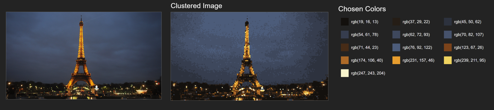
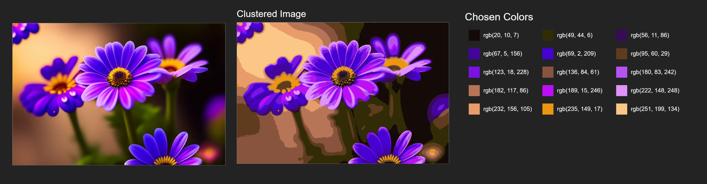
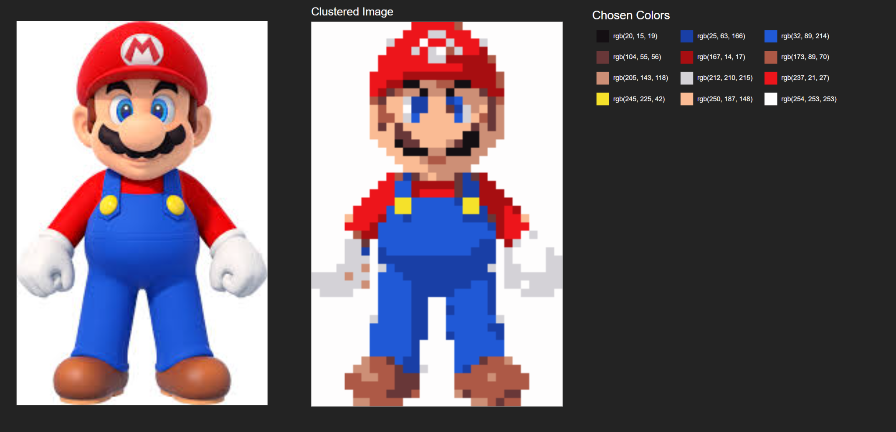
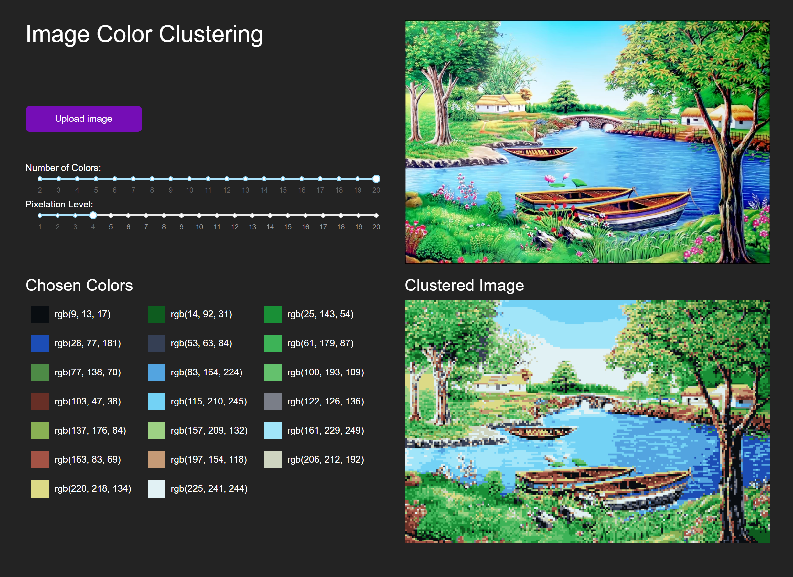

---

# Image Color Clustering Project

## Overview
This project is a web application built using Dash and Dash Bootstrap Components. It allows users to upload an image, adjust clustering parameters, and visualize the dominant colors in the image through K-means clustering. The app also displays a pixelated version of the image and a clustered image based on the selected number of colors.



## Features
- **Image Upload**: Users can upload an image in various formats (e.g., PNG, JPEG).
- **Adjustable Parameters**: Users can adjust the number of colors to cluster and the pixelation level of the image using sliders.
- **Visualization**: The app displays the uploaded image, the chosen colors, and the clustered image.
- **Dynamic Updates**: The color clustering results update dynamically based on the selected parameters.

## Installation
To run this project locally, follow these steps:

### Prerequisites
- Python 3.7 or higher
- `pip` package manager

### Step-by-Step Guide
1. **Clone the repository**:
   ```bash
   git clone <repository-url>
   cd <repository-folder>
   ```

2. **Create a virtual environment** (optional but recommended):
   ```bash
   python -m venv venv
   source venv/bin/activate  # On Windows use `venv\Scripts\activate`
   ```

3. **Install the required packages**:
   ```bash
   pip install -r requirements.txt
   ```

4. **Run the application**:
   ```bash
   python app.py
   ```

5. **Access the app**:
   Open your web browser and go to `http://127.0.0.1:8050/`.

## Usage
1. **Upload an Image**:
   - Click on the "Upload image" area to select an image file from your computer.

2. **Adjust Parameters**:
   - Use the "Number of Colors" slider to select the number of clusters (colors) you want.
   - Use the "Pixelation Level" slider to adjust the pixelation level of the image.

3. **View Results**:
   - The uploaded image will be displayed in the "Uploaded Image" section.
   - The chosen colors will be displayed in the "Chosen Colors" section.
   - The clustered image will be displayed in the "Clustered Image" section.

## Project Structure
```
.
├── app.py                  # Main application file
├── requirements.txt        # Required Python packages
└── README.md               # Project documentation
```

## Dependencies
- **Dash**: For building the web application.
- **Dash Bootstrap Components**: For styling the application.
- **PIL (Pillow)**: For image processing.
- **NumPy**: For numerical operations.
- **Scikit-learn**: For K-means clustering.

## Functions
### `pixelate_image(image, pixel_size)`
- **Description**: Pixelates the input image based on the given pixel size.
- **Parameters**: 
  - `image`: PIL Image object.
  - `pixel_size`: Integer, size of the pixelation.
- **Returns**: Pixelated PIL Image object.

### `calculate_colors(image, num_clusters)`
- **Description**: Calculates the dominant colors in the image using K-means clustering.
- **Parameters**: 
  - `image`: PIL Image object.
  - `num_clusters`: Integer, number of color clusters.
- **Returns**: Tuple containing the clustered image (PIL Image object) and an array of unique colors.

## Callbacks
### `display_uploaded_image(contents)`
- **Description**: Displays the uploaded image and clears the color and cluster sections when a new image is uploaded.
- **Inputs**: 
  - `contents`: Base64 encoded string of the uploaded image.
- **Outputs**: 
  - Updated image, cleared color section, and cleared cluster section.

### `update_clustering(num_clusters, pixelation_level, contents)`
- **Description**: Updates the color and cluster sections based on the number of clusters, pixelation level, and the uploaded image.
- **Inputs**:
  - `num_clusters`: Integer, value from the slider.
  - `pixelation_level`: Integer, value from the slider.
  - `contents`: Base64 encoded string of the uploaded image.
- **Outputs**: 
  - Updated color section and cluster section.


